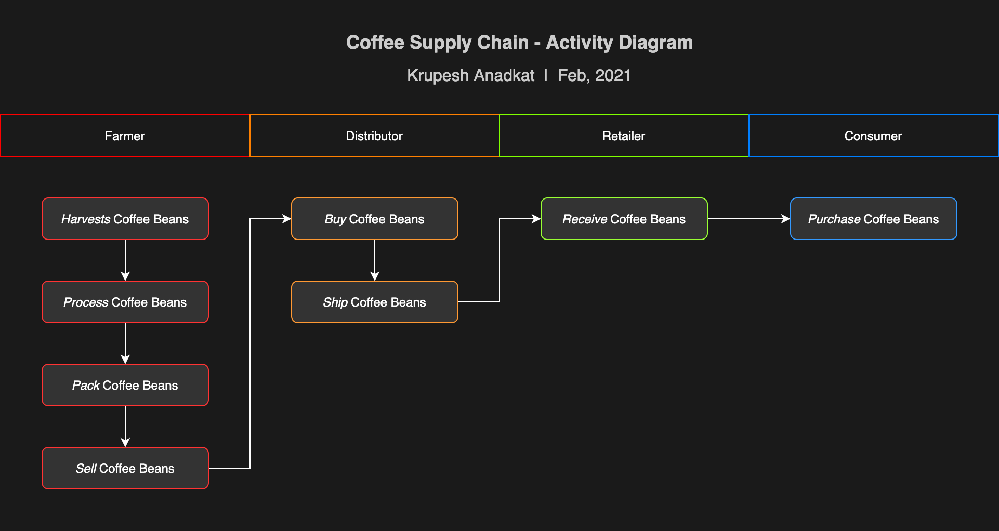
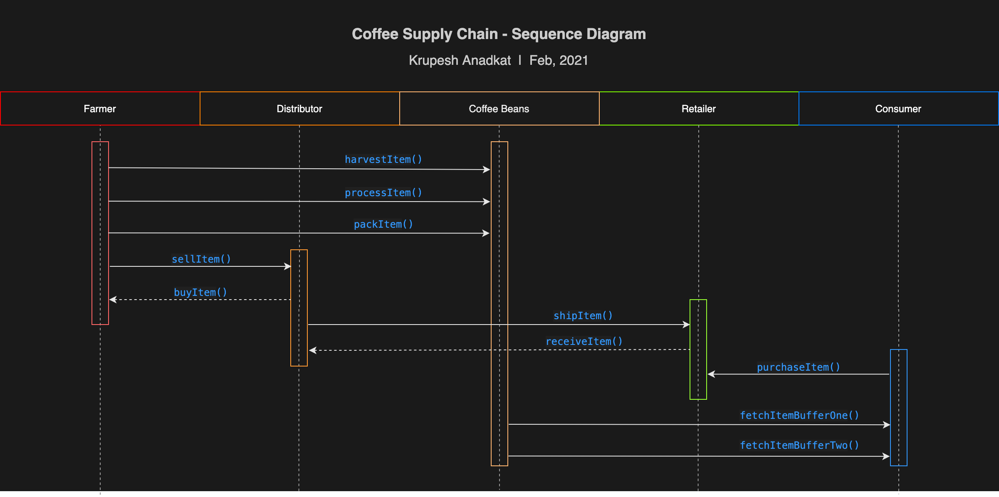
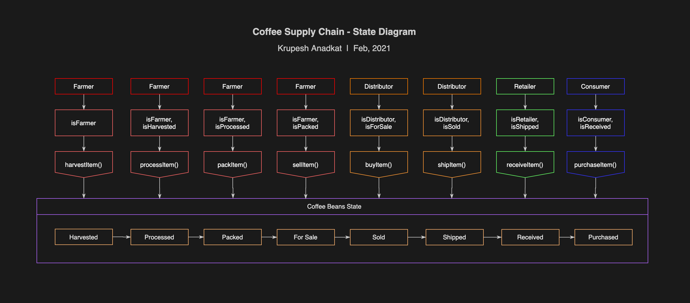
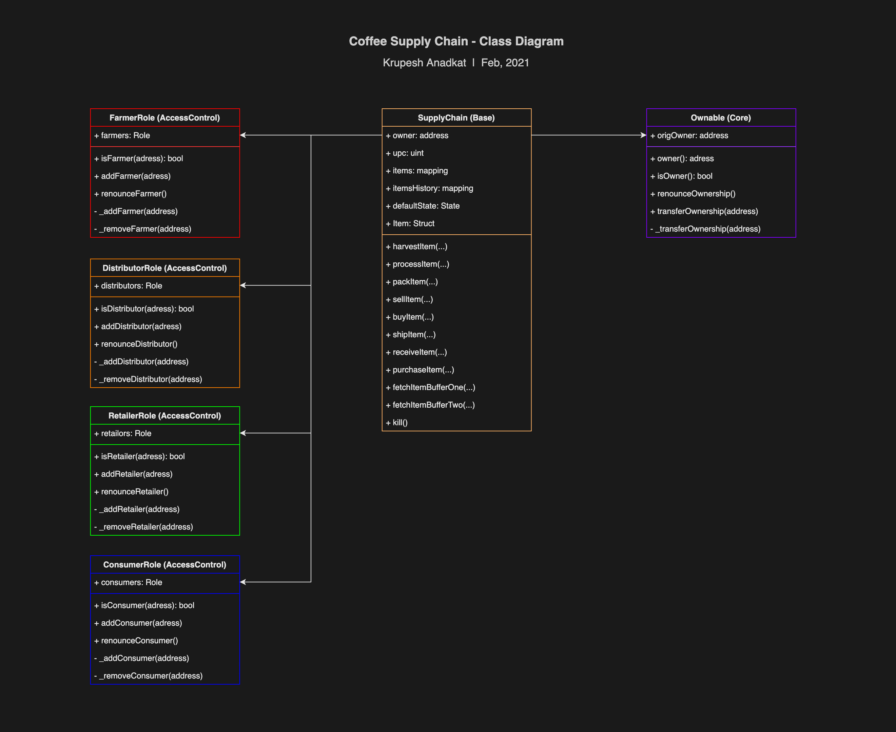
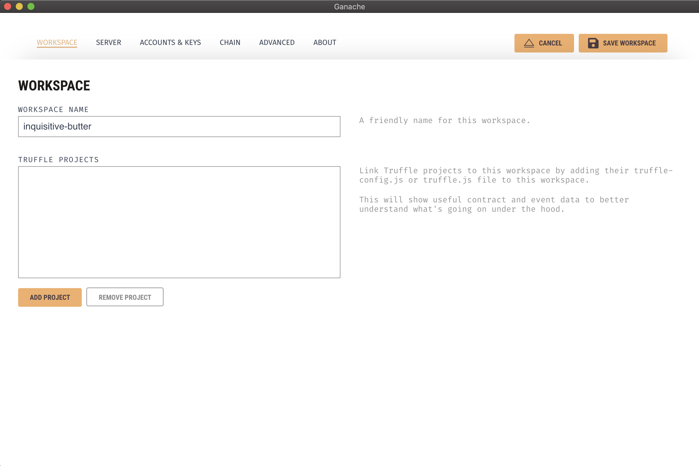
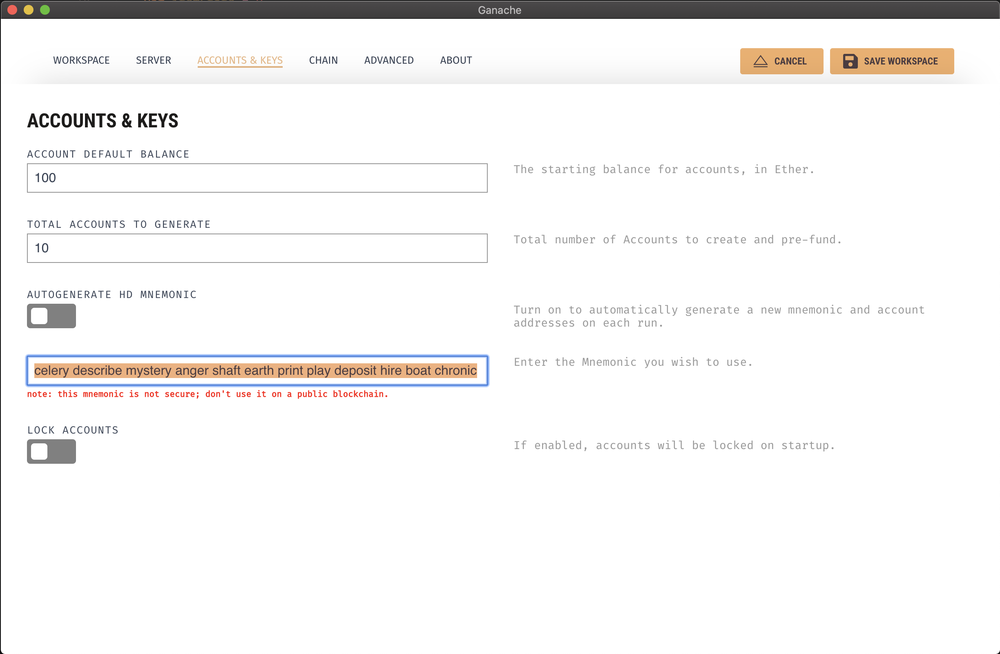
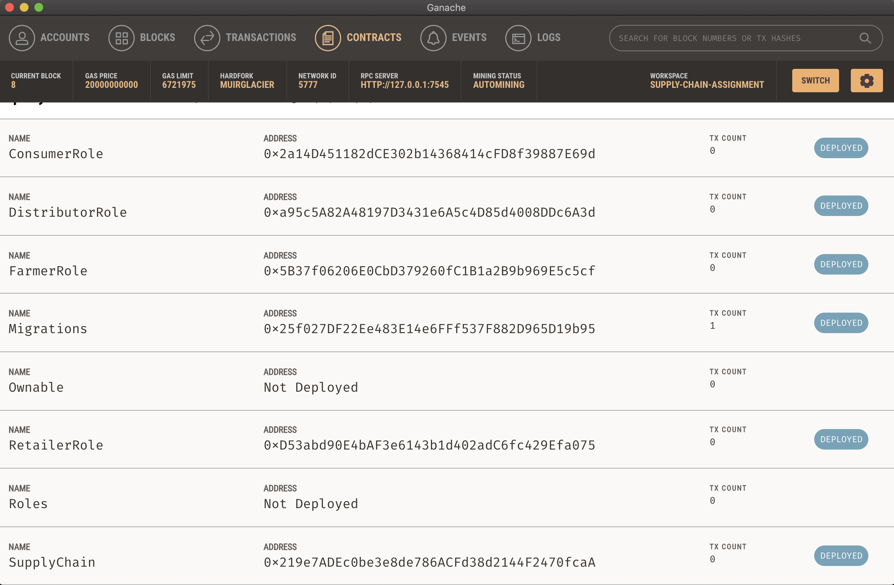
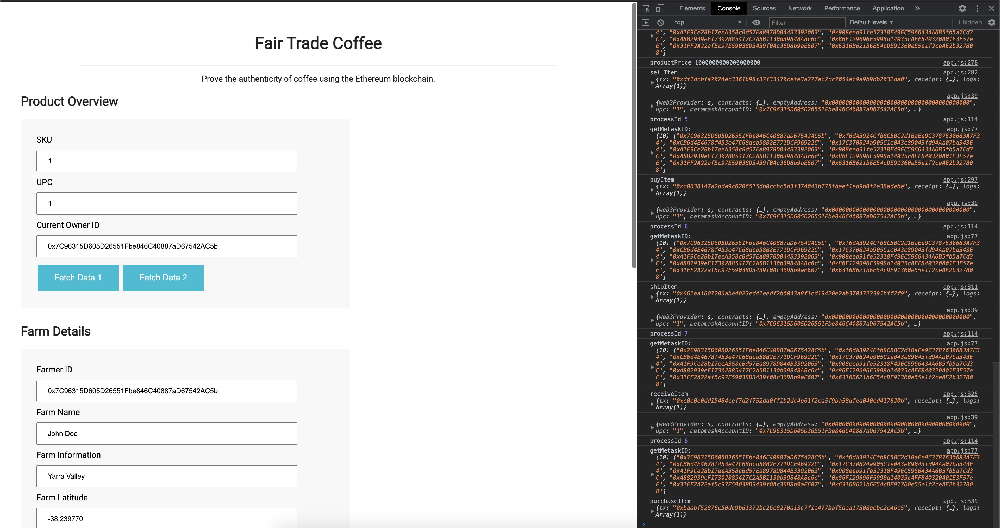

# Coffee Beans Supply Chain Project

This repository containts an Ethereum DApp that demonstrates a Supply Chain flow between a Seller and Buyer. The user story is similar to any commonly used supply chain process. A Seller can add items to the inventory system stored in the blockchain. A Buyer can purchase such items from the inventory system. Additionally a Seller can mark an item as Shipped, and similarly a Buyer can mark an item as Received.


## UML Diagrams

Below are the 4 UML diagrams that help us to architect & understand over all project flow. We have 4 major roles in this project : Farmer, Distributor, Retailer & Consumer. One entity that is being processed in Supply chain i.e. Coffee Beans.














## Project Libraries & Dependencies

- [Solidity v0.4.23^](https://docs.soliditylang.org/en/v0.4.23/) - Solidity is an object-oriented, high-level language for implementing smart contracts.
- [Truffle Framework](http://truffleframework.com/) - Truffle is the most popular development framework for Ethereum with a mission to make your life a whole lot easier.
- [web3.js](https://web3js.readthedocs.io/en/v1.3.0/) - It is a collection of libraries that allows to interact with a local or remote ethereum node.
- [Metamask](https://metamask.io/) - A crypto wallet & gateway to blockchain apps.

```
Truffle v5.1.61 (core: 5.1.61)
Solidity - 0.4.23 (solc-js)
Node v14.12.0
Web3.js v1.2.9
```


## Project Testing Steps

The project is configured to use [Ganache GUI](https://www.trufflesuite.com/ganache) tool. Below are the steps to run test cases : 

1. Download zip of master branch of this repository & extract the project folder.
2. Open project's root folder in terminal such that executing `ls` command shows `truffle.js` in output.
3. Run `npm install` in root directory to install all dependencies.
4. Launch Ganache, select New Workspace & below window should open. Click Add Project & locate `truffle.js` file in dialog box.



4. Click Account & Keys at top and change the mnemonic to following. Click Save Workspace at top right.
   `celery describe mystery anger shaft earth print play deposit hire boat chronic`



5. Coming back to Terminal (where project's root directory is open), confirm your truffle & dependencies version to match below:

   ```bash
   $ truffle version
   Truffle v5.1.61 (core: 5.1.61)
   Solidity - 0.4.23 (solc-js)
   Node v14.12.0
   Web3.js v1.2.9
   ```

6. Execute `truffle console` to launch truffle development environment in terminal.Then execute `truffle migrate --reset`, this will deploy all smart contracts to Ganache, you can view them in Contracts tab of workspace you created in steps 1 to 4.



Below is the terminal output of contract deployment for reference as described above.

```bash
truffle(development)> truffle migrate --reset

Compiling your contracts...
===========================
> Compiling ./contracts/Migrations.sol
> Compiling ./contracts/coffeeaccesscontrol/ConsumerRole.sol
> Compiling ./contracts/coffeeaccesscontrol/DistributorRole.sol
> Compiling ./contracts/coffeeaccesscontrol/FarmerRole.sol
> Compiling ./contracts/coffeeaccesscontrol/RetailerRole.sol
> Compiling ./contracts/coffeeaccesscontrol/Roles.sol
> Compiling ./contracts/coffeebase/SupplyChain.sol
> Compiling ./contracts/coffeecore/Ownable.sol
> Artifacts written to /Users/xeuser/Desktop/blockchain_nanodegree/projects/project-6/build/contracts
> Compiled successfully using:
   - solc: 0.4.23+commit.124ca40d.Emscripten.clang


Starting migrations...
======================
> Network name:    'development'
> Network id:      5777
> Block gas limit: 6721975 (0x6691b7)


1_initial_migration.js
======================

   Deploying 'Migrations'
   ----------------------
   > transaction hash:    0x8f90b380484971bcac743a4ae61a8bac548ed32b79f8673146300cc5b8214df4
   > Blocks: 0            Seconds: 0
   > contract address:    0x25f027DF22Ee483E14e6FFf537F882D965D19b95
   > block number:        1
   > block timestamp:     1613301190
   > account:             0x9cC1eBE342c3734E75b6fF346eCDc16e624554A3
   > balance:             99.99522812
   > gas used:            238594 (0x3a402)
   > gas price:           20 gwei
   > value sent:          0 ETH
   > total cost:          0.00477188 ETH


   > Saving migration to chain.
   > Saving artifacts
   -------------------------------------
   > Total cost:          0.00477188 ETH


2_deploy_contracts.js
=====================

   Deploying 'FarmerRole'
   ----------------------
   > transaction hash:    0xb4e021e76959d16542b22943613befdeaa91e79ae451c2029c308997e489a2d9
   > Blocks: 0            Seconds: 0
   > contract address:    0x5B37f06206E0CbD379260fC1B1a2B9b969E5c5cf
   > block number:        3
   > block timestamp:     1613301190
   > account:             0x9cC1eBE342c3734E75b6fF346eCDc16e624554A3
   > balance:             99.98810474
   > gas used:            313821 (0x4c9dd)
   > gas price:           20 gwei
   > value sent:          0 ETH
   > total cost:          0.00627642 ETH


   Deploying 'DistributorRole'
   ---------------------------
   > transaction hash:    0x2e6cccae159f6a0bbb3290ee9c6a1589506fc10c0943144b11b6d66debf97cac
   > Blocks: 0            Seconds: 0
   > contract address:    0xa95c5A82A48197D3431e6A5c4D85d4008DDc6A3d
   > block number:        4
   > block timestamp:     1613301190
   > account:             0x9cC1eBE342c3734E75b6fF346eCDc16e624554A3
   > balance:             99.98182832
   > gas used:            313821 (0x4c9dd)
   > gas price:           20 gwei
   > value sent:          0 ETH
   > total cost:          0.00627642 ETH


   Deploying 'RetailerRole'
   ------------------------
   > transaction hash:    0x37ac9113f4ac32d89480ac913a073de6ca26749ad427bb36ca77f5f4a90b6d9f
   > Blocks: 0            Seconds: 0
   > contract address:    0xD53abd90E4bAF3e6143b1d402adC6fc429Efa075
   > block number:        5
   > block timestamp:     1613301190
   > account:             0x9cC1eBE342c3734E75b6fF346eCDc16e624554A3
   > balance:             99.97555166
   > gas used:            313833 (0x4c9e9)
   > gas price:           20 gwei
   > value sent:          0 ETH
   > total cost:          0.00627666 ETH


   Deploying 'ConsumerRole'
   ------------------------
   > transaction hash:    0x8021366d094dbcf8c75c8c0c8bb227c2ceb222b1f5f8252117f062614f6a647c
   > Blocks: 0            Seconds: 0
   > contract address:    0x2a14D451182dCE302b14368414cFD8f39887E69d
   > block number:        6
   > block timestamp:     1613301190
   > account:             0x9cC1eBE342c3734E75b6fF346eCDc16e624554A3
   > balance:             99.96927524
   > gas used:            313821 (0x4c9dd)
   > gas price:           20 gwei
   > value sent:          0 ETH
   > total cost:          0.00627642 ETH


   Deploying 'SupplyChain'
   -----------------------
   > transaction hash:    0xc4ec8c4ce2f218ac902514cf3d5e4a790c88c1ff9c53b28d35bbde26c0d3e449
   > Blocks: 0            Seconds: 0
   > contract address:    0x219e7ADEc0be3e8de786ACFd38d2144F2470fcaA
   > block number:        7
   > block timestamp:     1613301191
   > account:             0x9cC1eBE342c3734E75b6fF346eCDc16e624554A3
   > balance:             99.91879212
   > gas used:            2524156 (0x2683fc)
   > gas price:           20 gwei
   > value sent:          0 ETH
   > total cost:          0.05048312 ETH


   > Saving migration to chain.
   > Saving artifacts
   -------------------------------------
   > Total cost:          0.07558904 ETH


Summary
=======
> Total deployments:   6
> Final cost:          0.08036092 ETH
```

7. Finally test project by executing command `truffle test` in truffle console. All tests should pass with output like below : 

   ```bash
   truffle(development)> truffle test
   Using network 'development'.
   
   
   Compiling your contracts...
   ===========================
   > Everything is up to date, there is nothing to compile.
   
   ganache-gui accounts used here...
   Contract Owner: accounts[0]  0x9cC1eBE342c3734E75b6fF346eCDc16e624554A3
   Farmer: accounts[1]  0xc00dC87606ad69BD41647871eA23EB365Fd4e277
   Distributor: accounts[2]  0x6c1779e412E53447f5DD04A7D62843017171c950
   Retailer: accounts[3]  0x0dAf4414932464e2c1E24E00532F44F694812DdF
   Consumer: accounts[4]  0x52d8A2Db18Ec6B875812b6cbcD5E88b0882E40F3
   
   
     Contract: SupplyChain
       ✓ Testing smart contract function harvestItem() that allows a farmer to harvest coffee (146ms)
       ✓ Testing smart contract function processItem() that allows a farmer to process coffee (109ms)
       ✓ Testing smart contract function packItem() that allows a farmer to pack coffee (87ms)
       ✓ Testing smart contract function sellItem() that allows a farmer to sell coffee (118ms)
       ✓ Testing smart contract function buyItem() that allows a distributor to buy coffee (159ms)
       ✓ Testing smart contract function shipItem() that allows a distributor to ship coffee (70ms)
       ✓ Testing smart contract function receiveItem() that allows a retailer to mark coffee received (146ms)
       ✓ Testing smart contract function purchaseItem() that allows a consumer to purchase coffee (130ms)
       ✓ Testing smart contract function fetchItemBufferOne() that allows anyone to fetch item details from blockchain (42ms)
       ✓ Testing smart contract function fetchItemBufferTwo() that allows anyone to fetch item details from blockchain (48ms)
   
   
     10 passing (1s)
   ```


## Running Project Locally

To test project locally, first complete all steps from `Project Testing Steps` above & then run `npm run dev`. Make sure Ganache GUI is running. It is preferred to disable metamask while testing project locally thus allowing to interact with contracts deployed in Ganache GUI. [http://localhost:3000](http://localhost:3000)




## Project Deploying Steps

Smart Contract is deployed in Rinkeby test net. To achieve this following were used:

- Truffle hdwallet provider v1.0.17
- Free Infura account key > project id
- Mnemonic of Metamask wallet seed phrase having sufficient test ether.

Following are the steps taken to deploy smart contract:

1. Open project's root folder in terminal such that executing `ls` command shows `truffle.js` in output.

2. Run `npm install` in root directory to install all dependencies.

3. Added `infuraKey` & `mnemonic` in `truffle.js` file. These are obscured in this repository for security reasons.

4. Added network configuration of Rinkeby as shown below : 

   ```js
   rinkeby: {
     provider: () => new HDWalletProvider(mnemonic, `https://rinkeby.infura.io/v3/${infuraKey}`),
     network_id: 4,       // Rinkeby's id
     gas: 5500000,        // Ropsten has a lower block limit than mainnet
     confirmations: 2,    // # of confs to wait between deployments. (default: 0)
     timeoutBlocks: 200,  // # of blocks before a deployment times out  (minimum/default: 50)
     skipDryRun: true     // Skip dry run before migrations? (default: false for public nets )
   },
   ```

5. In terminal, execute `truffle console` to open truffle development environment.

6. Run `truffle compile --reset` to compile all smart contracts located in `contracts` folder. Please delete existing `build` folder if any before executing command.

7. It is always good idea to test contracts before making a deployment, execute `truffle test` & verify that all 10 test cases are passed. 

8. Finally execute `truffle migrate --reset --network rinkeby` to deploy contracts on Rinkeby. This can take some time since it will wait for atleast 2 confirmations before next contract is deployed.

Below is the log of complete process:

```bash
truffle(development)> truffle compile --reset
> Warning: possible unsupported (undocumented in help) command line option: --reset

Compiling your contracts...
===========================
> Compiling ./contracts/Migrations.sol
> Compiling ./contracts/coffeeaccesscontrol/ConsumerRole.sol
> Compiling ./contracts/coffeeaccesscontrol/DistributorRole.sol
> Compiling ./contracts/coffeeaccesscontrol/FarmerRole.sol
> Compiling ./contracts/coffeeaccesscontrol/RetailerRole.sol
> Compiling ./contracts/coffeeaccesscontrol/Roles.sol
> Compiling ./contracts/coffeebase/SupplyChain.sol
> Compiling ./contracts/coffeecore/Ownable.sol
> Artifacts written to /Users/xeuser/Desktop/blockchain_nanodegree/projects/project-6/build/contracts
> Compiled successfully using:
   - solc: 0.4.23+commit.124ca40d.Emscripten.clang

truffle(development)> truffle test
Using network 'development'.


Compiling your contracts...
===========================
> Everything is up to date, there is nothing to compile.

ganache-gui accounts used here...
Contract Owner: accounts[0]  0x9cC1eBE342c3734E75b6fF346eCDc16e624554A3
Farmer: accounts[1]  0xc00dC87606ad69BD41647871eA23EB365Fd4e277
Distributor: accounts[2]  0x6c1779e412E53447f5DD04A7D62843017171c950
Retailer: accounts[3]  0x0dAf4414932464e2c1E24E00532F44F694812DdF
Consumer: accounts[4]  0x52d8A2Db18Ec6B875812b6cbcD5E88b0882E40F3


  Contract: SupplyChain
    ✓ Testing smart contract function harvestItem() that allows a farmer to harvest coffee (194ms)
    ✓ Testing smart contract function processItem() that allows a farmer to process coffee (122ms)
    ✓ Testing smart contract function packItem() that allows a farmer to pack coffee (109ms)
    ✓ Testing smart contract function sellItem() that allows a farmer to sell coffee (107ms)
    ✓ Testing smart contract function buyItem() that allows a distributor to buy coffee (206ms)
    ✓ Testing smart contract function shipItem() that allows a distributor to ship coffee (90ms)
    ✓ Testing smart contract function receiveItem() that allows a retailer to mark coffee received (188ms)
    ✓ Testing smart contract function purchaseItem() that allows a consumer to purchase coffee (172ms)
    ✓ Testing smart contract function fetchItemBufferOne() that allows anyone to fetch item details from blockchain (41ms)
    ✓ Testing smart contract function fetchItemBufferTwo() that allows anyone to fetch item details from blockchain (47ms)


  10 passing (1s)

truffle(development)> truffle migrate --reset --network rinkeby

Compiling your contracts...
===========================
> Everything is up to date, there is nothing to compile.


Starting migrations...
======================
> Network name:    'rinkeby'
> Network id:      4
> Block gas limit: 10000000 (0x989680)


1_initial_migration.js
======================

   Deploying 'Migrations'
   ----------------------
   > transaction hash:    0xad79ae753cb5808e1795f48d3fd6c0e69afd6869b36c1eec04ceceaddba2e0a6
   > Blocks: 2            Seconds: 21
   > contract address:    0x4743E28931a0A1d5b5de0796929077747448A780
   > block number:        8071620
   > block timestamp:     1613302930
   > account:             0xca2ceb85734dF92E8d78360d9658A81232Be4622
   > balance:             40.641985967
   > gas used:            238594 (0x3a402)
   > gas price:           20 gwei
   > value sent:          0 ETH
   > total cost:          0.00477188 ETH

   Pausing for 2 confirmations...
   ------------------------------
   > confirmation number: 1 (block: 8071621)
   > confirmation number: 2 (block: 8071622)

   > Saving migration to chain.
   > Saving artifacts
   -------------------------------------
   > Total cost:          0.00477188 ETH


2_deploy_contracts.js
=====================

   Deploying 'FarmerRole'
   ----------------------
   > transaction hash:    0xc4a94f836e4d64b440645efe584d4c24f127dec308f9b9636ccbbd64347876ec
   > Blocks: 1            Seconds: 9
   > contract address:    0x449bA343f7828cD4c4c3e5C67Ec6Ad3C405Dd1b5
   > block number:        8071624
   > block timestamp:     1613302990
   > account:             0xca2ceb85734dF92E8d78360d9658A81232Be4622
   > balance:             40.634862587
   > gas used:            313821 (0x4c9dd)
   > gas price:           20 gwei
   > value sent:          0 ETH
   > total cost:          0.00627642 ETH

   Pausing for 2 confirmations...
   ------------------------------
   > confirmation number: 1 (block: 8071625)
   > confirmation number: 2 (block: 8071626)

   Deploying 'DistributorRole'
   ---------------------------
   > transaction hash:    0x688d84c01fa4b0ee5e5f3863bf74bcddcbde28339a6015004612c11d19259d3e
   > Blocks: 1            Seconds: 13
   > contract address:    0xe3d0f3cF24e670a822d913e746bA9d292a53fb3a
   > block number:        8071627
   > block timestamp:     1613303035
   > account:             0xca2ceb85734dF92E8d78360d9658A81232Be4622
   > balance:             40.628586167
   > gas used:            313821 (0x4c9dd)
   > gas price:           20 gwei
   > value sent:          0 ETH
   > total cost:          0.00627642 ETH

   Pausing for 2 confirmations...
   ------------------------------
   > confirmation number: 1 (block: 8071628)
   > confirmation number: 2 (block: 8071629)

   Deploying 'RetailerRole'
   ------------------------
   > transaction hash:    0xcd4958923fe6d383e131c486f2533166ecaf992009d9071f8ef5f4498f65508f
   > Blocks: 1            Seconds: 9
   > contract address:    0x53574456A79F6b4e3f4f3a7779B7f4aeD545da53
   > block number:        8071630
   > block timestamp:     1613303080
   > account:             0xca2ceb85734dF92E8d78360d9658A81232Be4622
   > balance:             40.622309507
   > gas used:            313833 (0x4c9e9)
   > gas price:           20 gwei
   > value sent:          0 ETH
   > total cost:          0.00627666 ETH

   Pausing for 2 confirmations...
   ------------------------------
   > confirmation number: 1 (block: 8071631)
   > confirmation number: 2 (block: 8071632)

   Deploying 'ConsumerRole'
   ------------------------
   > transaction hash:    0xf23d9429c7351b96d619dfda0224107da4baf175fef342d86d933c21750b8958
   > Blocks: 1            Seconds: 9
   > contract address:    0x837cAFCAA446105e986591Ec6A44ed04F8abCa29
   > block number:        8071633
   > block timestamp:     1613303125
   > account:             0xca2ceb85734dF92E8d78360d9658A81232Be4622
   > balance:             40.616033087
   > gas used:            313821 (0x4c9dd)
   > gas price:           20 gwei
   > value sent:          0 ETH
   > total cost:          0.00627642 ETH

   Pausing for 2 confirmations...
   ------------------------------
   > confirmation number: 1 (block: 8071634)
   > confirmation number: 2 (block: 8071635)

   Deploying 'SupplyChain'
   -----------------------
   > transaction hash:    0xadf87d88ed0cde914436d1dc214d1f8d7cc3195cf28bc50d4aef636536d31995
   > Blocks: 1            Seconds: 13
   > contract address:    0x88F903a3aebE7E84C1dca2521021e8b012d64486
   > block number:        8071636
   > block timestamp:     1613303170
   > account:             0xca2ceb85734dF92E8d78360d9658A81232Be4622
   > balance:             40.565549967
   > gas used:            2524156 (0x2683fc)
   > gas price:           20 gwei
   > value sent:          0 ETH
   > total cost:          0.05048312 ETH

   Pausing for 2 confirmations...
   ------------------------------
   > confirmation number: 1 (block: 8071637)
   > confirmation number: 2 (block: 8071638)

   > Saving migration to chain.
   > Saving artifacts
   -------------------------------------
   > Total cost:          0.07558904 ETH


Summary
=======
> Total deployments:   6
> Final cost:          0.08036092 ETH
```


## Rinkeby Deployment Details

Tx Hashes & Contract addresses are hyperlinks, one can click them & see it on Rinkeby etherscan.

| Smart Contract     | Tx Hash                                                      |
| ------------------ | ------------------------------------------------------------ |
| 1. FarmerRole      | [0xc4a94f836e4d64b440645efe584d4c24f127dec308f9b9636ccbbd64347876ec](https://rinkeby.etherscan.io/tx/0xc4a94f836e4d64b440645efe584d4c24f127dec308f9b9636ccbbd64347876ec) |
| 2. DistributorRole | [0x688d84c01fa4b0ee5e5f3863bf74bcddcbde28339a6015004612c11d19259d3e](https://rinkeby.etherscan.io/tx/0x688d84c01fa4b0ee5e5f3863bf74bcddcbde28339a6015004612c11d19259d3e) |
| 3. RetailerRole    | [0xcd4958923fe6d383e131c486f2533166ecaf992009d9071f8ef5f4498f65508f](https://rinkeby.etherscan.io/tx/0xcd4958923fe6d383e131c486f2533166ecaf992009d9071f8ef5f4498f65508f) |
| 4. ConsumerRole    | [0xf23d9429c7351b96d619dfda0224107da4baf175fef342d86d933c21750b8958](https://rinkeby.etherscan.io/tx/0xf23d9429c7351b96d619dfda0224107da4baf175fef342d86d933c21750b8958) |
| 5. SupplyChain     | [0xadf87d88ed0cde914436d1dc214d1f8d7cc3195cf28bc50d4aef636536d31995](https://rinkeby.etherscan.io/tx/0xadf87d88ed0cde914436d1dc214d1f8d7cc3195cf28bc50d4aef636536d31995) |

Below are the Contract address:

| Smart Contract     | Contract Address                                             |
| ------------------ | ------------------------------------------------------------ |
| 1. FarmerRole      | [0x449bA343f7828cD4c4c3e5C67Ec6Ad3C405Dd1b5](https://rinkeby.etherscan.io/address/0x449bA343f7828cD4c4c3e5C67Ec6Ad3C405Dd1b5) |
| 2. DistributorRole | [0xe3d0f3cf24e670a822d913e746ba9d292a53fb3a](https://rinkeby.etherscan.io/address/0xe3d0f3cf24e670a822d913e746ba9d292a53fb3a) |
| 3. RetailerRole    | [0x53574456a79f6b4e3f4f3a7779b7f4aed545da53](https://rinkeby.etherscan.io/address/0x53574456a79f6b4e3f4f3a7779b7f4aed545da53) |
| 4. ConsumerRole    | [0x837cafcaa446105e986591ec6a44ed04f8abca29](https://rinkeby.etherscan.io/address/0x837cafcaa446105e986591ec6a44ed04f8abca29) |
| 5. SupplyChain     | [0x88f903a3aebe7e84c1dca2521021e8b012d64486](https://rinkeby.etherscan.io/address/0x88f903a3aebe7e84c1dca2521021e8b012d64486) |


